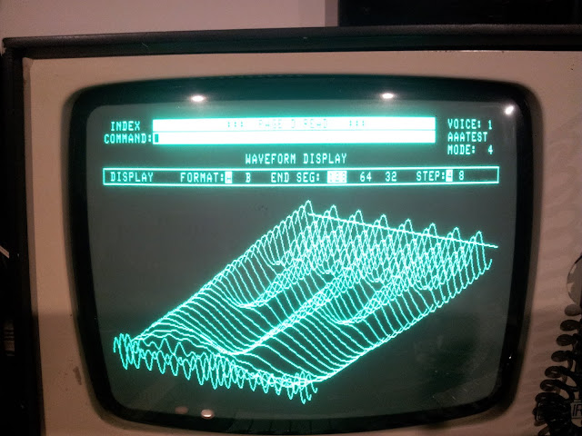

# fairlight-player
A tribute to the Fairlight CMI in mp3 player form

The Fairlight CMI (Computer Musical Instrument) was a groundbreaking digital sampling synthesizer and workstation introduced in 1979 by Australians Peter Vogel and Kim Ryrie. It revolutionized pop music in the 1980s by allowing users to record, manipulate, and play back acoustic sounds on a keyboard via digital sampling.

It featured a CRT display and light pen, allowing musicians to draw or modify waveforms and harmonics directly on screen, and on one page, page D, stacked the wave form up over time.

This player pays tribute to that early design, by turning your mp3 into that same page D stacked wave form display.
